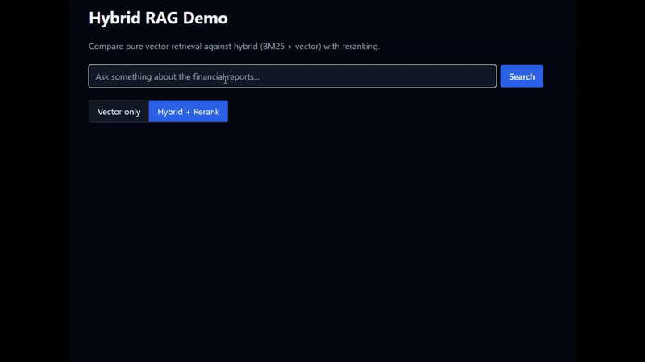
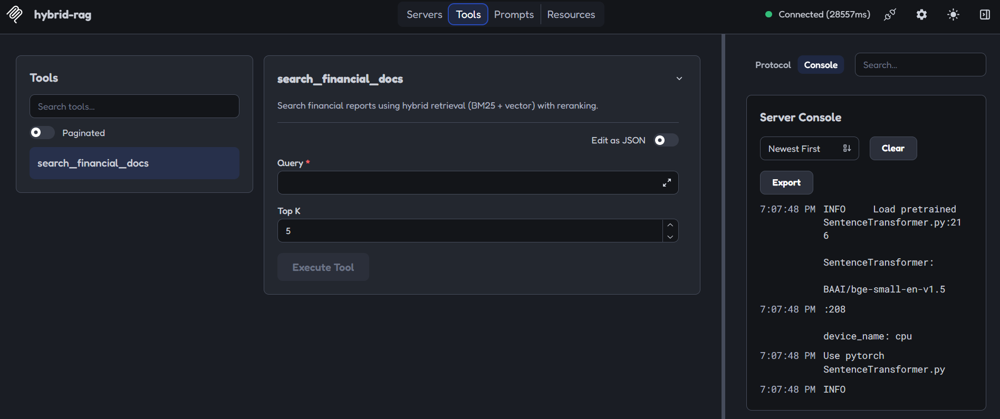
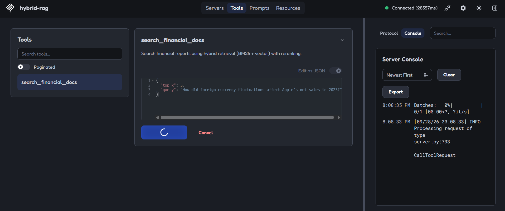
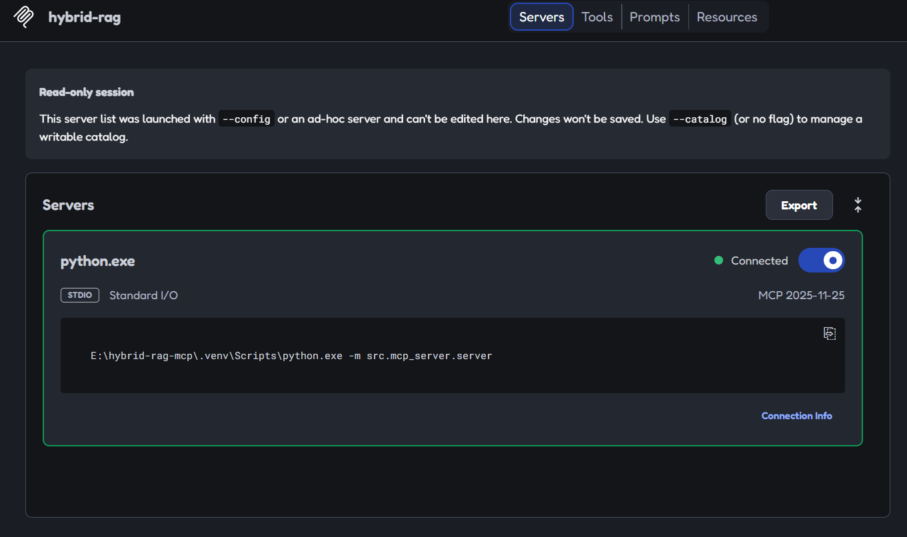
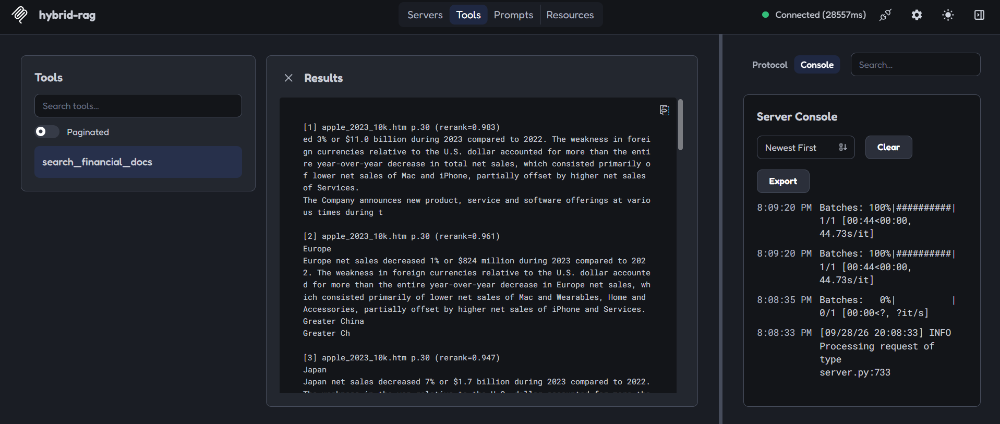
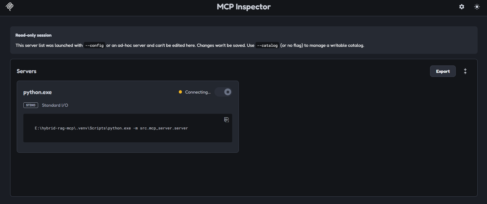

# Hybrid RAG over SEC Filings

A hybrid retrieval system over SEC 10-K filings that combines **BM25 keyword search**, **dense vector search**, **Reciprocal Rank Fusion**, and **cross-encoder reranking** — exposed as a FastAPI endpoint, an MCP tool, and a Next.js frontend.

[](https://github.com/HOORIAGABA/mcp-hybrid-rag/actions/workflows/ci.yml)



## What This Does

Given a natural-language question about a company's financials, this system returns the exact chunks needed to answer it — with source and page citations.

The frontend toggle compares **vector-only** retrieval against **hybrid + rerank**. On the query *"How did foreign currency fluctuations affect Apple's net sales in 2023?"*, vector-only fails to surface the correct paragraph in the top 5. Hybrid + rerank returns it at rank #1 with a rerank score of 0.983.

## Architecture

```
                          ┌─────────────────────────────┐
                          │  Ingestion (run once)       │
                          │  SEC EDGAR → parse → chunk  │
                          └──────────────┬──────────────┘
                                         │
                          ┌──────────────┴──────────────┐
                          ▼                             ▼
                   ┌─────────────┐              ┌──────────────┐
                   │ BM25 index  │              │ Vector index │
                   │ (sparse)    │              │ (ChromaDB)   │
                   └──────┬──────┘              └──────┬───────┘
                          │                             │
              query ──────┼─────────────────────────────┼────── query
                          ▼                             ▼
                    top-20 by BM25              top-20 by cosine
                          │                             │
                          └──────────┬──────────────────┘
                                     ▼
                          ┌────────────────────┐
                          │  RRF Fusion (k=60) │
                          └─────────┬──────────┘
                                    ▼
                          ┌────────────────────┐
                          │  BGE Cross-Encoder │
                          │  Reranker (top-5)  │
                          └─────────┬──────────┘
                                    ▼
                     ┌──────────────┴──────────────┐
                     ▼                             ▼
              FastAPI /search              MCP tool: search_financial_docs
                     │                             │
                     ▼                             ▼
              Next.js frontend              Any MCP-compatible AI client
```
See [`docs/architecture.md`](docs/architecture.md) for a deeper dive into the module structure and design decisions.

## Why Hybrid?

BM25 nails exact terms (`ROIC`, `$383,285`, `fiscal 2023`) but misses paraphrases. Dense embeddings understand meaning but blur specific numbers and entity names. Fusing them with Reciprocal Rank Fusion combines both strengths; a cross-encoder reranker does the final precision cut.

### Retrieval Quality Comparison

| Query | Vector-only rank of correct answer | Hybrid + Rerank rank | Rerank score |
|---|---|---|---|
| *How did foreign currency fluctuations affect Apple's net sales in 2023?* | **Not in top 5** | **#1** | 0.983 |
| *How much did Apple spend on research and development in 2023?* | #2 | **#1** | 0.969 |
| *What was Apple's total net sales in 2023?* | #3 | **#1** | 0.998 |

The foreign-currency query is the most dramatic case: the correct paragraph doesn't appear in the vector-only top 5 at all. Notice the trace on the winning chunk in hybrid mode:

```
rerank=0.983 | bm25#20 | vec#12
```

BM25 ranked it #20. Vector ranked it #12. Neither retriever alone would have surfaced it. The reranker promoted it to #1.


## Retrieval Evaluation

Evaluated on **22 hand-labeled queries** over three SEC 10-K filings
(Apple, Microsoft, Alphabet — fiscal year 2023). Three queries are negative
controls with no answer in the corpus and are excluded from the averages
below. Metrics computed at K=5.

### Overall Results

| Metric | Vector-only | Hybrid + Rerank | Improvement |
|---|---|---|---|
| **Precision@5** | 0.232 | **0.274** | +18% |
| **Recall@5** | 0.772 | **0.930** | +20% |
| **MRR** | 0.589 | **0.833** | +41% |

**Recall@5 = 0.930** — the hybrid pipeline surfaced the correct chunk in
the top 5 for 18 out of 19 answerable queries. Vector-only missed it in
roughly 1 in 4 queries.

**MRR = 0.833** — the correct chunk averages rank ~1.2 in hybrid mode
(essentially always #1 or #2). Vector-only averages rank ~1.7.

### Per-Category Breakdown (Hybrid)

| Category | n | Precision@5 | MRR |
|---|---|---|---|
| Narrative | 5 | 0.280 | **1.000** |
| Segment | 4 | 0.250 | 0.875 |
| Comparative | 2 | 0.300 | 0.750 |
| Numeric | 8 | 0.275 | 0.729 |

**Narrative queries achieve perfect MRR (1.000).** Every narrative question
— foreign currency impact, iPhone sales decline, FX risk factors, cloud
competition risks, Services growth drivers — had the correct chunk ranked
**#1** in hybrid mode. This is the cross-encoder's strength: narrative
questions have no exact keyword to match, so BM25 alone struggles. The
reranker reading query and chunk together resolves them cleanly.

### Negative Controls

Three queries in the golden set have no ground-truth answer in the corpus:

| Query | Top rerank score (Hybrid) | Interpretation |
|---|---|---|
| What did Apple's CEO say about AI strategy in 2023? | **0.044** | Strong negative — no relevant content |
| What was Tesla's net income in 2023? | 0.465 | Weak negative — domain match, no entity match |
| What was Amazon's net income in 2023? | 0.520 | Weak negative — domain match, no entity match |

These are excluded from precision/recall/MRR averages because there's no
correct chunk to retrieve. But they demonstrate the **no-answer signature**
of the reranker: when the correct chunk doesn't exist, the top rerank score
drops to 0.04–0.52, compared to 0.7+ for answerable queries.

A production RAG system would use this signal to refuse answering
("I don't have enough information") instead of hallucinating.

### Known Limitations

**Numeric queries on non-Apple filings perform worse (MRR = 0.729).**
For queries like *"What was Alphabet's R&D expense in 2023?"*, the reranker
ranked two irrelevant Alphabet chunks above the correct R&D table. Financial
filings mention the same metrics in many sections, so bi-encoders struggle
to distinguish "total revenue" from "revenue by segment" or "revenue
commentary."

A production system would address this with **metadata filtering** —
restricting retrieval to the correct company's document and the correct
section (income statement, MD&A, notes) before reranking.

**Weak negatives (Tesla, Amazon) score higher than ideal (0.46–0.52).**
Because these queries share domain vocabulary ("net income") with the
corpus, the reranker gives moderate scores even though the entities are
absent. Entity-level filtering would fix this.

### Reproducing

```bash
python -m src.evaluation.evaluate
```

Ground-truth labels live in `src/evaluation/golden_queries.json`.
Full per-query output: [`results/evaluation_2026-09-28.txt`](results/evaluation_2026-09-28.txt).

## MCP Integration

The same retrieval engine is exposed as an MCP (Model Context Protocol) tool. Any MCP-compatible AI client — Claude Desktop, Cursor, the MCP Inspector — can discover the tool and invoke it with a natural language query.

**Tool discovery** — the MCP client reads the tool schema from Python type hints and docstring:



**Tool invocation** — the client calls `search_financial_docs` and receives grounded results:



**Connection and results** in the MCP Inspector:




**Inspector overview:**



## Tech Stack

| Layer | Technology |
|---|---|
| **Parsing** | `pypdf`, `beautifulsoup4` |
| **Chunking** | `langchain-text-splitters` (RecursiveCharacterTextSplitter only) |
| **Sparse retrieval** | `rank_bm25` (BM25Okapi) |
| **Dense retrieval** | `BAAI/bge-small-en-v1.5`, ChromaDB |
| **Fusion** | Reciprocal Rank Fusion (k=60) |
| **Reranking** | `BAAI/bge-reranker-v2-m3` (cross-encoder) |
| **Backend** | FastAPI, uvicorn |
| **Agent layer** | MCP (Model Context Protocol) |
| **Frontend** | Next.js 16, React 19, Tailwind CSS |

## Why No LangChain

Every stage of the retrieval pipeline is explicit code. When asked *"how does your retrieval work?"*, I can point to actual logic rather than a framework wrapper:

- `src/retrieval/bm25_index.py` — tokenization and BM25 construction
- `src/retrieval/vector_index.py` — embedding and Chroma queries
- `src/retrieval/fusion.py` — RRF formula
- `src/retrieval/reranker.py` — cross-encoder scoring

LangChain's `EnsembleRetriever` and `ContextualCompressionRetriever` would hide all of this behind configuration.

## Project Structure

```
hybrid-rag-mcp/
├── data/                   Raw 10-K filings and processed chunks
├── docs/                   Screenshots, demo GIF, architecture notes
├── frontend/               Next.js UI
├── index/                  BM25 pickle + ChromaDB vector store
├── scripts/                build_indexes.py, test_retrieval.py
├── src/
│   ├── ingestion/          Download, parse, chunk
│   ├── retrieval/          BM25, vector, RRF, reranker
│   ├── api/                FastAPI app
│   ├── mcp_server/         MCP tool definition
│   └── evaluation/         Side-by-side comparison script
└── tests/                  Smoke tests
```

## Run It Locally

```bash
# 1. Setup
python -m venv .venv
.venv\Scripts\Activate.ps1     # Windows
# source .venv/bin/activate    # macOS/Linux
pip install -r requirements.txt
copy .env.example .env          # Windows
# cp .env.example .env          # macOS/Linux

# 2. Build indexes (downloads 10-Ks, chunks, builds BM25 + Chroma)
python -m scripts.build_indexes

# 3. Test retrieval from the CLI
python -m scripts.test_retrieval "How did foreign currency fluctuations affect Apple's net sales in 2023?"

# 4. Start the backend
uvicorn src.api.main:app --reload

# 5. Start the frontend (in a new terminal)
cd frontend
npm install
npm run dev
```

Open `http://localhost:3000` and try the toggle.

### Test the MCP Server

```bash
npx @modelcontextprotocol/inspector "E:\path\to\.venv\Scripts\python.exe" -m src.mcp_server.server
```

Then in the browser: **Connect → Tools → `search_financial_docs` → Run Tool**.

## Deployment Notes

This project is designed to run locally. The backend loads two BGE models (~2.3GB total), which exceeds the memory limits of free-tier hosting services like Render, Railway, and Fly.io.

For production deployment, the pipeline would need either:

- A paid instance with **4GB+ RAM**, or
- A lighter cross-encoder such as `cross-encoder/ms-marco-MiniLM-L-6-v2` (~80MB), at some cost to reranking quality

## Corpus

Three SEC 10-K filings:

- Apple Inc. — fiscal year 2023
- Microsoft Corporation — fiscal year 2023
- Alphabet Inc. — fiscal year 2023

Total: ~1,700 chunks after recursive character splitting (800-char chunks, 150-char overlap).

## License

MIT — see [LICENSE](LICENSE).